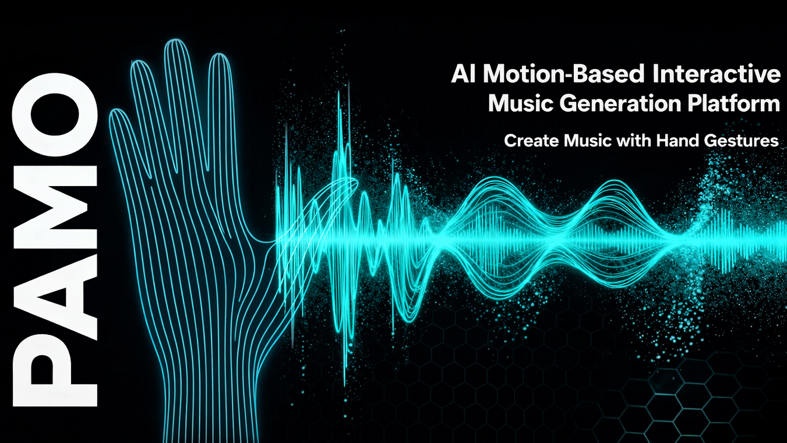
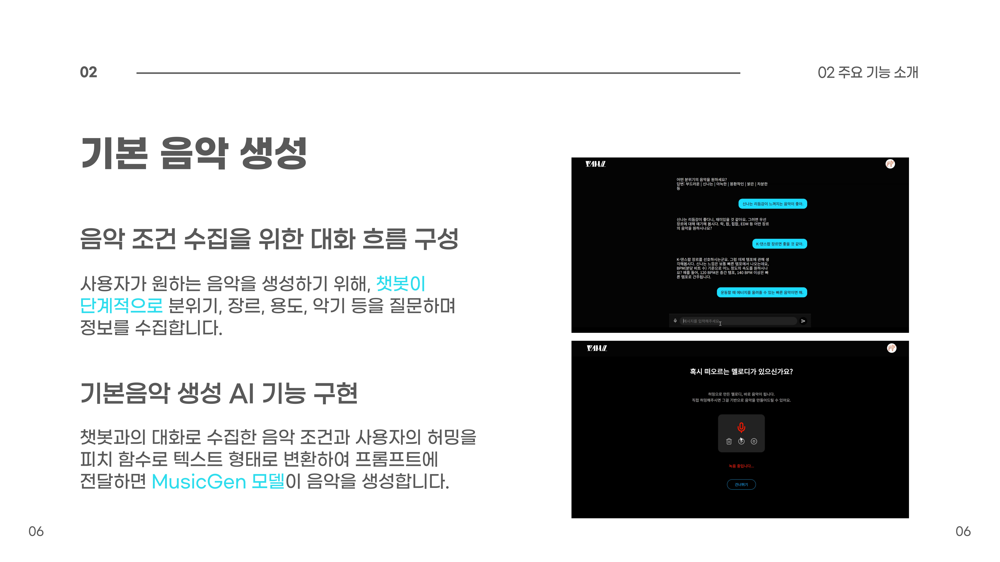
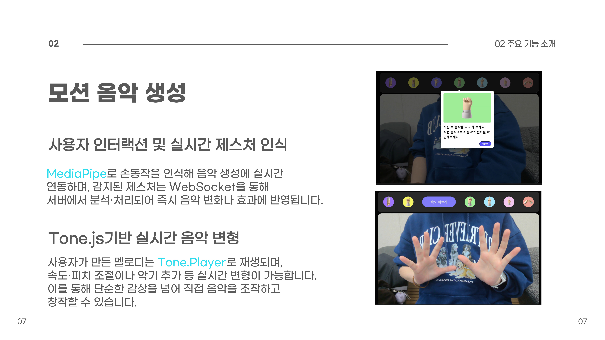
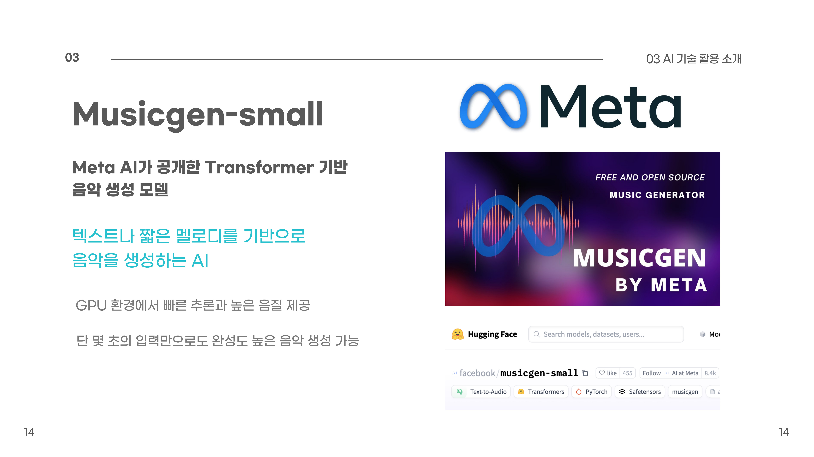
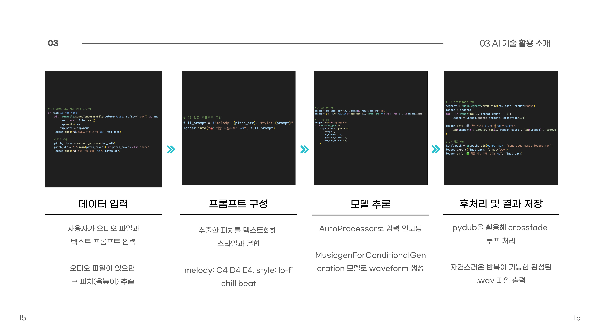
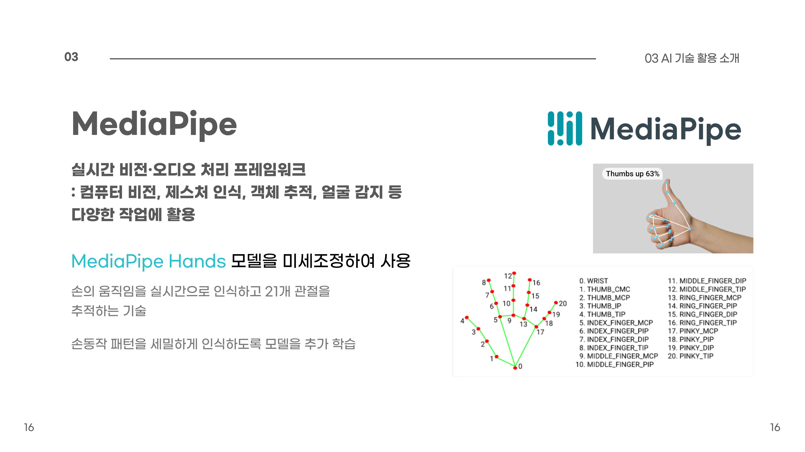
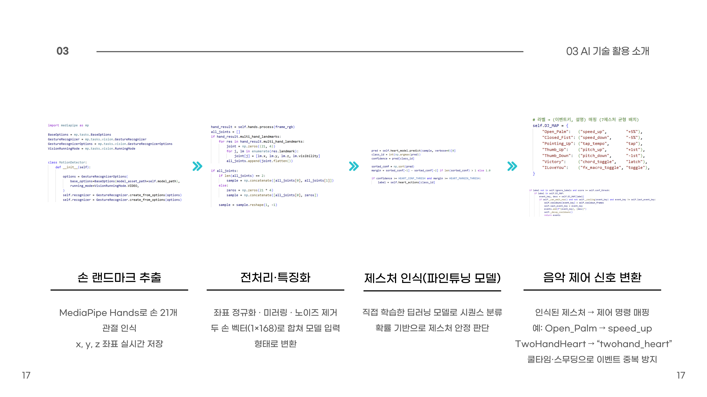

# 🎵 PAMO (AI Motion-based Music Generation)

# 😀 백엔드 팀원 및 역할

| 이름   | 역할      | 담당   |
| ------ | --------- | ----- |
| 소원 | Back-end / AI |

배포·인프라, 인증, 음악 생성 플로우, 백엔드 아키텍처 설계
<b>☁️ 배포 및 서버 인프라 구축</b><ul><li>Docker 기반 서버 컨테이너화 및 AWS EC2 클라우드 배포 환경 구성</li><li>Nginx 리버스 프록시 설정 및 Route53 기반 DNS 도메인 연결</li><li>HTTPS 적용을 고려한 배포 구조 설계</li><li>CORS · Redirect 등 인증·배포 환경에서 발생하는 이슈 분석 및 해결</li><li>멀티 스테이지 Docker 빌드 및 .dockerignore 적용을 통한 이미지 최적화</li><li>개발·운영 환경 분리를 고려한 배포 테스트 및 검증 수행</li></ul><b>🔐 인증 및 사용자 접근 구조 구현</b><ul><li>Spring Security + OAuth2 기반 소셜 로그인 구조 구현 (Google · Kakao · Naver)</li><li>JWT 기반 Access Token / Refresh Token 인증 흐름 설계</li><li>토큰 검증 흐름을 정비하여 인증 상태에 따른 API 접근 제어 및 사용자 식별 구조 구현</li></ul><b>🎵 대화 기반 음악 생성 플로우 로직</b><ul><li>음악 생성 과정에서 사용자 입력 상태에 따라 분기되는 서버 로직 설계</li><li>대화 흐름에 따라 질문 유도, 요약, 종료 상태로 전환되는 분기 처리 구현</li><li>음악 생성에 필요한 입력 조건을 정리·확정하는 요약 API 개발</li><li>대화 결과를 기반으로 AI 음악 생성에 적합한 프롬프트 정제 로직 구현</li></ul><b>🎶 음악 도메인 및 상태 관리</b><ul><li>기본 음악과 생성 음악을 분리한 도메인 모델링</li><li>음악 공개·비공개 여부 관리 로직 구현</li><li>기존 생성 조건을 활용한 음악 다시 생성 플로우 설계</li></ul><b>🔍 검색 및 조회 기능 API 구현</b><ul><li>음악 검색 API 설계 및 구현</li><li>검색 대상(all/basic/motion), 정렬 기준(relevance/recent/popular), limit을 고려한 쿼리 구조 설계</li><li>로그인 사용자 기준 개인화된 조회 결과 제공 구조 반영</li></ul><b>📘 공통 응답 포맷 및 API 문서화</b><ul><li>모든 API에서 사용하는 공통 응답 포맷(CustomResponse&lt;T&gt;) 설계 및 적용</li><li>성공/실패 케이스를 고려한 일관된 API 응답 구조 정립</li><li>Swagger(OpenAPI) 기반 API 문서 정비 및 엔드포인트 설명 추가</li></ul><b>🗄️ 데이터 모델 및 프로젝트 구조 정비</b><ul><li>AWS RDS(MySQL) 기반 서비스 데이터 저장 환경 구성</li><li>음악, 사용자, 생성 이력 중심의 전체 서비스 ERD 설계</li><li>User, Music 등 핵심 엔티티 구조 수정 및 초기화 로직 정비</li><li>폴더 구조 정리 및 코드 스타일 통일을 위한 리팩터링 수행</li></ul>
|
| 조소윤 | Back-end / AI | 

둘러보기, 마이페이지, 음악 공통 기능 API, 사용자 활동 기능(좋아요·북마크), AI 연계 구조 설계
<b>🧭 둘러보기(Explore) 페이지 API</b><ul><li>둘러보기 페이지에 필요한 API 전반 구현</li><li>최다 재생 음악, 인기 순위, 최신 등록 음악 조회 API 구현</li><li>사용자가 좋아요한 음악 목록 조회 API 구현</li><li>비로그인 사용자 접근 시 좋아요 목록이 null로 처리되도록 분기 로직 구성</li><li>둘러보기 화면에서 음악 상세 페이지로 연결되는 상세 조회 API 구현</li></ul><b>👤 마이페이지 API</b><ul><li>마이페이지에서 사용되는 전반적인 서버 API 구현</li><li>사용자가 생성한 내 음악 목록 조회 API 구현</li><li>사용자가 보관한 음악(라이브러리) 목록 조회 API 구현</li><li>모션 음악 공개 / 비공개 여부 관리 로직 및 API 구현</li><li>사용자 프로필 사진 수정 API 구현</li><li>사용자 닉네임 수정 API 구현</li><li>마이페이지 내 음악 상세 조회 API 구현</li></ul><b>🎵 음악 공통 기능 API</b><ul><li>기본 음악(BaseMusic)과 모션 음악(MotionMusic)에 공통 적용되는 기능을 분리해 공통 API로 설계</li><li>기본 음악 삭제 API 구현</li><li>모션 음악 삭제 API 구현</li><li>기본 음악 제목 수정 API 구현</li><li>모션 음악 제목 수정 API 구현</li><li>기능 중복을 줄이기 위해 수정·삭제 로직을 공통 기능으로 관리</li></ul><b>❤️ 좋아요 / 🔖 북마크 기능</b><ul><li>모션 음악 좋아요 추가 / 삭제 API 구현</li><li>기본 음악 북마크(보관함) 추가 / 삭제 API 구현</li><li>사용자별 상태를 고려한 토글 방식 로직 처리</li><li>중복 요청 및 잘못된 상태 변경에 대한 예외 처리</li></ul><b>🧩 API 구조 및 역할 분리</b><ul><li>둘러보기, 마이페이지, 음악 공통 기능을 이슈 단위로 분리해 관리</li><li>여러 화면에서 재사용되는 로직을 공통 API로 추출해 유지보수성 향상</li></ul><b>📚 API 문서화 및 인증 테스트</b><ul><li>Swagger(OpenAPI) 문서 정리</li><li>JWT 인증 토큰을 Swagger에서 직접 입력해 보호된 API 테스트 가능하도록 설정</li></ul><b>🧠 AI 모델 활용 방식 및 실시간 통신 설계</b><ul><li>허밍 mp3 기반 Magenta 모델의 한계를 보완하기 위해 멜로디 추출 후 텍스트 프롬프트로 변환하는 음악 생성 방식을 고안</li><li>MediaPipe를 활용한 사용자 동작 인식 감지 및 모션 음악 생성 연계 방향 설계</li><li>모션 인식 처리를 위해 React 클라이언트와 FastAPI 서버 간 WebSocket 기반 실시간 통신 구조 구현</li></ul>
 |
| 홍다인 | Back-end  / AI  |

AI 모션 인식 & 음악 생성 코어 파이프라인, 멀티모달 데이터 연동 및 S3 인프라 구축
<b>🖐️ 자체 제스처 데이터셋 구축 및 AI 모델 고도화</b><ul><li>외부 데이터 없이 직접 7종 제스처(포인팅 업/다운, 주먹, 보자기, 브이, 손가락 하트, 양손 하트) 영상 촬영 및 데이터 수집</li><li>MediaPipe Hands 기반 관절 좌표 추출 및 168차원 고정 길이 벡터(Zero-padding 적용)로 입력 데이터 규격 통일</li><li>TensorFlow Keras 기반 Dense MLP 신경망 설계 및 최종 테스트 정확도 98% 달성</li><li>학습된 모델을 FastAPI 추론 서버에 적용하여 실시간 제스처 분류 및 음악 제어 이벤트 매핑 시스템 완성</li></ul><b>⚖️ 실시간 인식 안정화 및 하드 필터링 로직 (Stability Engine)</b><ul><li>확률 기반 필터링: 예측 모델의 확신도(Top-1)가 0.9 이상이고, 2순위와의 차이가 0.25 이상일 때만 유효한 동작으로 판정</li><li>프레임 스무딩: 찰나의 오인식을 방지하기 위해 최근 5프레임 중 3프레임 이상 동일한 제스처가 감지될 때만 이벤트 확정</li><li>물리적 검증: Victory(손가락 2개), OpenPalm(4개 이상) 등 모델 결과와 실제 펴진 손가락 개수를 대조하는 보정 규칙 추가</li><li>이벤트 쓰로틀링: 의도치 않은 중복 명령 방지를 위해 1초 간격의 쿨다운 및 30프레임 중복 방지 로직 적용</li></ul><b>🎼 피치(Pitch) 추출 및 조건부 음악 생성 파이프라인</b><ul><li>사용자 허밍 파일에서 노이즈를 제거하고 순수 음높이 정보를 분석하는 extract_pitches() 알고리즘 개발</li><li>Librosa Piptrack 기반 주파수 추출 및 음이름(Note) 시퀀스 변환 로직 구현</li><li>Melody-to-Prompt: 추출된 음표 리스트를 "melody: C4 E4..." 형태의 텍스트 가이드로 변환해 MusicGen 모델에 주입</li><li>Crossfade 후처리: 생성 음원의 앞뒤를 부드럽게 연결하여 끊김 없는 반복 재생(Loop) 음원 자동 제작</li></ul><b>🎙️ AI 음악 생성 및 재생성(Regeneration) API</b><ul><li>세션 ID(sessionId)를 조회하여 DB의 요약 텍스트(summaryText)를 프롬프트로 활용하는 생성 API 구현</li><li>허밍 파일 존재 여부에 따라 멜로디 가이드 포함/미포함 분기 처리 및 Spring Boot - FastAPI 통신 인터페이스 구축</li><li>기존 음원(fileUrl)을 입력 소스로 재투입하여 일관성을 유지하며 다시 만드는 재생성 API 구현</li><li>재생성 시 기존 데이터는 보존하고 새로운 BaseMusic 레코드를 생성하여 버전별로 관리할 수 있는 구조 설계</li></ul><b>🎬 멀티모달 모션 비디오 업로드 및 자동화</b><ul><li>사용자 촬영 모션 영상(mp4) 및 변형 오디오 전용 업로드 API와 S3 저장 구조 구축</li><li>기본 음악(BaseMusic)과 모션 영상(MotionMusic) 간의 1:N 관계 매핑 및 DB 데이터 정규화</li><li>영상 업로드 시 내부 Python 서비스와 연동하여 영상 프레임 썸네일 자동 추출 및 커버 이미지 등록</li><li>제목 미입력 시 "나의 노래 N", "나의 모션뮤직비디오" 등 자동 명명 규칙(Auto-Naming) 적용</li></ul><b>☁️ AWS S3 인프라 아키텍처 및 스토리지 연동 상세</b><ul><li>AWS S3 버킷 생성 및 서비스 용도별(music, motion-video, motion-thumbs) 경로 체계 설계</li><li>IAM(Identity and Access Management) 사용자 생성 및 S3 접근 권한 정책(Policy) 설정을 통한 보안 액세스 제어</li><li>보안 강화를 위한 Pre-signed URL 발급 로직 구현 및 클라이언트 직접 업로드 방식 도입으로 서버 부하 최적화</li><li>Spring Boot(Java) 및 FastAPI(Python) 환경 각각에 적합한 AWS SDK 연동 라이브러리 구축 및 연동</li><li>UUID 기반 파일 네이밍 룰 적용을 통한 데이터 충돌 방지 및 DB 내 파일 메타데이터(URL, Key) 정합성 관리</li><li>AWS EC2 인스턴스 내 Nginx 리버스 프록시 설정 및 Certbot을 활용한 SSL(HTTPS) 인증서 적용으로 보안 통신 환경 배포</li><li>AWS Route53 도메인 연결 및 백엔드/AI 서버 간 독립적 인퍼런스 환경 구축을 통한 시스템 확장성 확보</li></ul>
 |
 

## 1. AI 개요

- 사용자의 실시간 손동작(Motion)과 음성 피치(Pitch) 데이터를 활용하여
**MediaPipe + MusicGen + Tone.js 파이프라인**으로 직관적인 음악 창작 AI 구축
- 텍스트 프롬프트뿐만 아니라 **사용자의 허밍이나 피치 흐름을 텍스트로 변환**하여
음악 모델에 주입함으로써 개인화된 멜로디 생성 가능
- 복잡한 음악 장비 없이도 **손가락 끝의 움직임만으로 리듬, 속도, 이펙트를 제어**하는
새로운 형태의 AI 인터랙티브 창작 경험 제공

## 2. AI 아키텍처 개요

- **Vision:** MediaPipe Hands를 활용한 21개 랜드마크 실시간 추적 및 제스처 분류
- **Generative AI:** MusicGen(Meta) 기반으로 피치 조건부 음악 생성 (Conditional Generation)
- **Audio Engine:** Tone.js 및 Web Audio API를 이용한 실시간 오디오 조작 및 필터링
- **Preprocessing:** 사용자 음성 피치 추출 → 음표 시퀀스 변환 → 프롬프트 구성
- **Pipeline:**
모션 감지 → 제스처 신호 변환 → 음악 파라미터 업데이트 → 실시간 오디오 렌더링

## 3. 모델 세부 구성

## 📘 3-1. 피치 조건부 음악 생성 (MusicGen)

- **Pitch-to-Text Prompting:** 오디오의 피치 패턴을 분석하여 `C4 D4 E4`와 같은 음표 시퀀스로 변환
- **Conditional Generation:** `melody: [음표 시퀀스] style: [분위기]` 형태의 프롬프트를 MusicGen 모델에 입력
- **Audio Post-processing:** 생성된 짧은 시퀀스를 Crossfade 기법으로 연결하여 자연스럽게 반복되는 루프(Loop) 음악 완성

## 🔍 3-2. 실시간 모션 인식 (MediaPipe Hands)

- **Landmark Extraction:** 손의 21개 관절 위치를 (x, y, z) 좌표로 실시간 추출
- **Gesture Mapping:** 자체 수집한 7가지 핵심 제스처(PointingUp/Down, OpenPalm 등) 데이터셋으로 인식 정확도 극대화
- **Real-time Control:** 손의 위치(y축)로 음 높이를 조절하고, 제스처를 통해 드럼 비트 추가나 리버브 효과 적용

## 🎧 3-3. 실시간 인터랙션 & 오디오 엔진

- **Web Audio Pipeline:** 브라우저 내에서 딜레이 없는 실시간 오디오 변형 환경 구축
- **Speed & Pitch Control:** AI가 생성한 소스 음악의 재생 속도와 피치를 모션 데이터와 동기화
- **End-to-End 창작:** 사용자 입력(피치/텍스트) → AI 생성 → 실시간 모션 조작 → 최종 창작물 저장

 

## 4. 개발 스택

### 🧠 AI / Machine Learning

## 5. 참고 자료

- Meta AI: MusicGen (Simple and Controllable Music Generation)
- Google MediaPipe: Hands Landmark Detection
- Web Audio API & Tone.js Documentation
